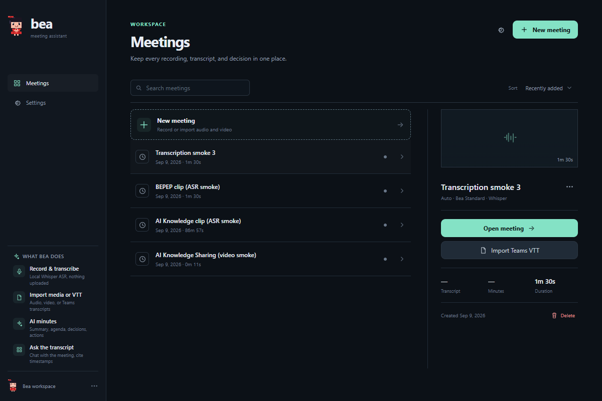
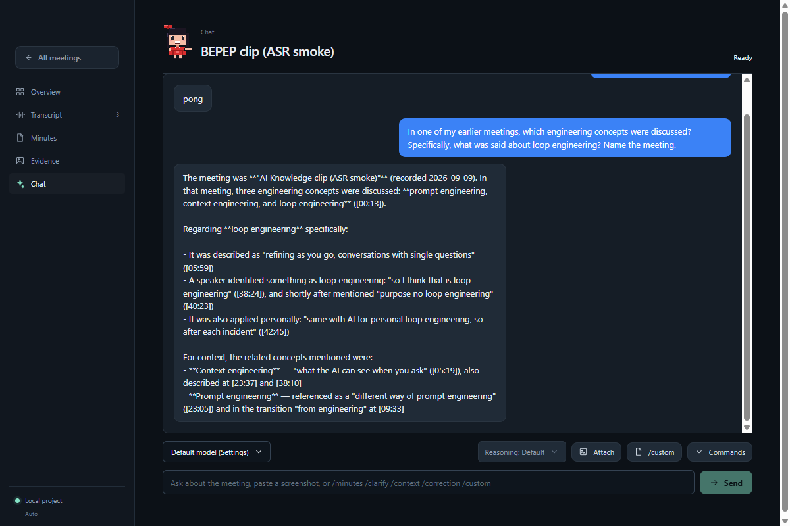
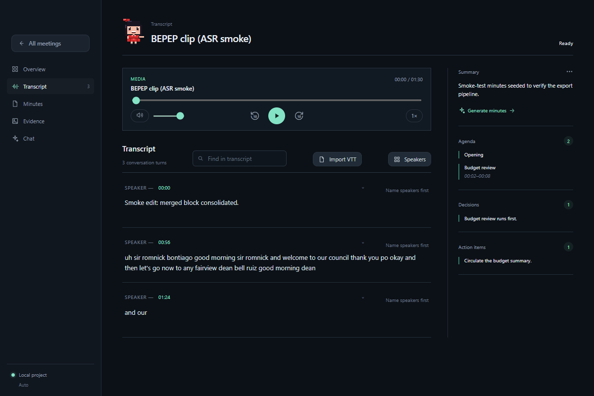
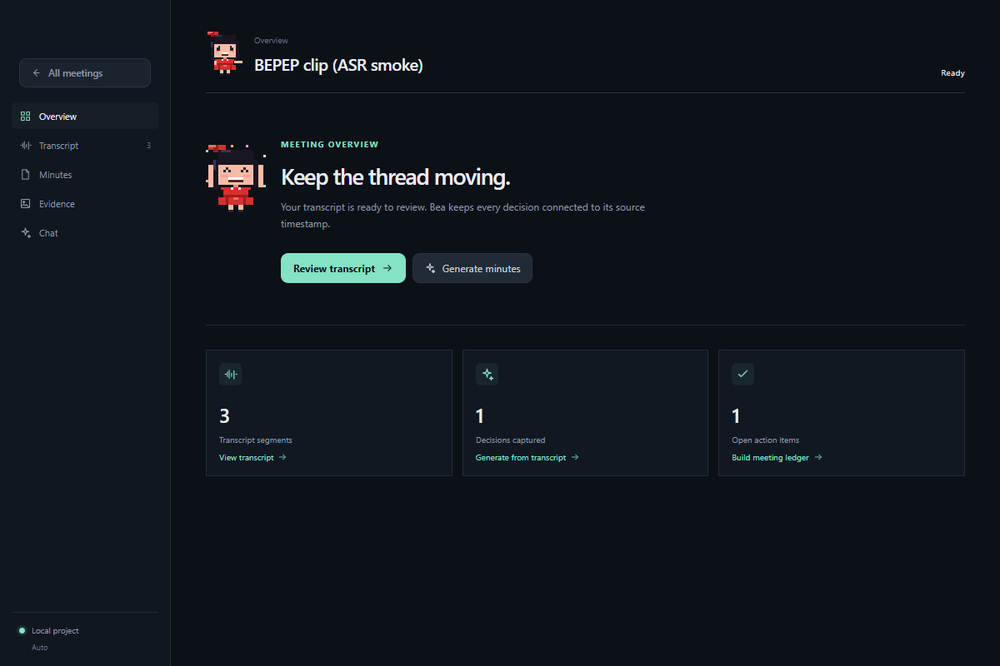
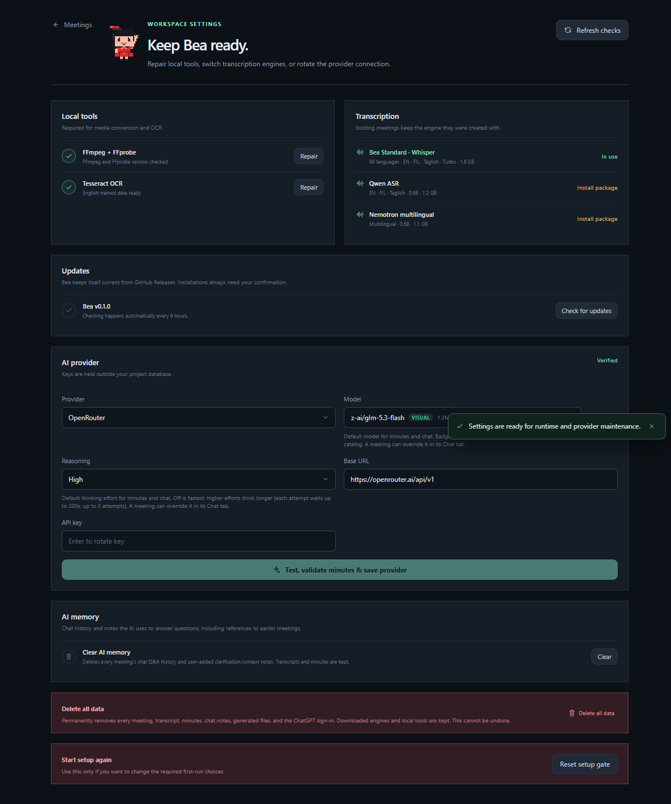

<div align="center">


# Bea — Attentive Meeting Assistant

**Record it. Transcribe it locally. Ask it anything — across every meeting.**




</div>

Bea is a local-first Windows desktop meeting assistant built with React, Vite, Tauri 2, Rust, SQLite, and sherpa-onnx. It guides a user through a verified first-run setup, then provides a project-oriented meeting library and a focused workspace for recordings, transcripts, minutes, evidence, and media.

The product is designed for reviewable meeting records rather than a full multitrack editor. Audio and video remain local. Bea creates timestamped transcript segments, links decisions and action items back to evidence, and optionally uses a configured OpenAI-compatible provider to generate structured minutes.

## Install

Download the latest installer from **[github.com/NitroQ/bea/releases](https://github.com/NitroQ/bea/releases/tag/v0.2.0)**:

| File | Use it when |
|---|---|
| `Bea_*_x64-setup.exe` | Recommended for most users — per-user install, includes the auto-updater |
| `Bea_*_x64_en-US.msi` | Per-machine install (all users of the PC) or IT/Intune deployment |

1. Run `Bea_0.2.0_x64-setup.exe`.
2. If Windows SmartScreen shows **"Windows protected your PC"**, click **More info → Run anyway**. (The installer is signed with Bea's update key but not yet with an Authenticode certificate, so SmartScreen asks for confirmation on first launch.)
3. Follow the guided setup: Bea verifies FFmpeg/FFprobe and OCR, installs a transcription engine, and connects your AI provider.

Once installed, Bea keeps itself current: it checks GitHub Releases every 6 hours and installs updates only after you confirm.

### Installing on Intune-managed PCs (unsigned-package restrictions)

On locked-down corporate machines, per-user SmartScreen prompts may be disabled entirely. Have your IT team deploy Bea through **Intune** — management-service deployments install silently in machine context and are the supported way to distribute internal packages that lack Authenticode signing:

1. **Distribute the MSI as a Windows app (Win32 or LOB):**
   - Upload `Bea_0.2.0_x64_en-US.msi` in [Intune admin center](https://intune.microsoft.com) → *Apps → Windows*.
   - Install command: `msiexec /i Bea_0.2.0_x64_en-US.msi /qn /norestart`
   - Uninstall command: `msiexec /x {ProductCode} /qn` (or `msiexec /x Bea_0.2.0_x64_en-US.msi /qn`)
2. **Detection rule:** file `C:\Program Files\Bea\bea.exe` exists, version `0.2.0.0`.
3. **If AppLocker/WDAC blocks unsigned binaries**, ask IT to allow-list the package — either as a hash rule using the official SHA256 digests, or by re-signing the installers with the organization's code-signing certificate (the cleanest long-term option):

   ```text
   Bea_0.2.0_x64-setup.exe  SHA256: CB9A7D2CBBDCFE8C10AB4230DFF23CD98C92E6E53FE53AAEA0D12F172CD8C785
   Bea_0.2.0_x64_en-US.msi  SHA256: 6C695FC21BD37BA7709255484B385DCF117E3B6A09FC692D1520725AE7EB4987
   ```

4. Users then install Bea from **Company Portal**, and the auto-updater keeps it current. If the tenant blocks unsigned auto-updates as well, IT can re-deploy new versions through Intune; the in-app update notice will point users to the release.

## What Bea does

- Detects and repairs the local media/OCR runtime.
- Checks both FFmpeg and FFprobe by executing `--version` and validating the version output.
- Checks Tesseract plus the selected `eng.traineddata` pack.
- Installs or imports verified Qwen, Whisper, and Nemotron sherpa-onnx packages.
- Records microphone audio into bounded, restart-discoverable WAV chunks.
- Imports audio/video, normalizes audio through FFmpeg, and creates local transcript segments.
- Supports transcript search, timestamp navigation, segment editing, waveform peaks, and media inventory.
- Extracts decisions, action items, unresolved questions, and timestamped evidence.
- Generates and edits minutes locally, with Markdown, PDF, and DOCX export.
- Supports OpenRouter, OpenAI-compatible endpoints, Claude-compatible proxies, local OpenAI-compatible servers (LM Studio, Ollama, llama.cpp — no API key required), and OpenAI ChatGPT/Codex subscription sign-in via OAuth, all using the `/chat/completions` contract (OAuth uses the Codex `/responses` endpoint).
- Local servers are tested and discovered keylessly; pick a preset (LM Studio `:1234/v1`, Ollama `:11434/v1`, llama.cpp `:8080/v1`) and Bea lists the server's loaded models.
- ChatGPT sign-in uses OAuth PKCE in your browser; tokens are refreshed automatically and stored in Windows Credential Manager alongside API keys.
- Stores provider secrets in Windows Credential Manager; SQLite stores only a credential reference.
- **Ask across meetings** — chat questions pull relevant passages from every other meeting's transcript (local FTS5 memory) and cite them with speaker names and timestamps.
- Keeps itself current — Bea checks GitHub Releases every 6 hours and installs updates only with your confirmation.

## Screenshots

**Chat with cross-meeting memory** — asked in one meeting, Bea finds and cites the answer from another meeting's transcript:



**Timestamped transcripts with named speakers:**



**Every meeting is a workspace** — overview, transcript, minutes, evidence, and media:



**Verified setup at a glance** — runtime tools, transcription engines, provider health:



## Product flow

1. **Essentials** — Bea checks FFmpeg + FFprobe and Tesseract.
2. **Transcription** — Select Qwen Standard, Whisper compatibility, or Nemotron multilingual. A verified package or extracted folder is required before continuing.
3. **Provider** — Choose a provider, model, URL, and API key. Bea performs a minimal live completion test before setup can finish.
4. **Library** — Search, sort, create, import, rename, delete, or open meeting projects.
5. **Meeting workspace** — Use Overview, Transcript, Minutes, Evidence, and Media sections. Record/import from the shared top bar and keep generated content connected to source timestamps.

Existing meetings snapshot their ASR engine at creation time. Changing the global default engine does not change an existing project.

## Architecture

```text
React/Vite UI
  ├─ SetupFlow       first-run readiness and repair UX
  ├─ Library         meeting projects, search, sorting, inspector
  ├─ MeetingWorkspace transcript, playback, minutes, evidence, media
  └─ Settings        runtime repair, engine selection, provider rotation
          │ Tauri invoke/events
Rust/Tauri command layer (`src-tauri/src/main.rs`)
  ├─ runtime detection and bundled repair
  ├─ model inspection, checksum validation, installation and removal
  ├─ recording, media import, FFmpeg/FFprobe orchestration
  ├─ provider testing, model discovery, secure credential storage
  └─ bounded waveform, transcript, minutes, and export commands
          │
Bea core library (`src-tauri/src/lib.rs`)
  ├─ SQLite/WAL persistence and backward-compatible migrations
  ├─ sherpa-onnx ASR adapters
  ├─ transcript FTS5 search and evidence ledger extraction
  ├─ provider request/response contracts and usage accounting
  └─ media, recording, waveform, OCR, and export primitives
```

### Persistent data

The app-data database contains meetings, ASR snapshots, transcript segments, recording chunks, media sources, model manifests, provider metadata, usage records, ledger events, minutes, and setup settings. API-key values are deliberately excluded from SQLite and logs.

### Runtime assets

Bundled runtime assets live under [`src-tauri/binaries`](src-tauri/binaries):

- `ffmpeg-x86_64-pc-windows-msvc.exe`
- `ffprobe-x86_64-pc-windows-msvc.exe`
- `tesseract/tesseract.exe`
- Tesseract DLLs and `tessdata/eng.traineddata`

During development, Bea also detects `ffmpeg.exe` and `ffprobe.exe` beside the running `bea.exe` (for example, `src-tauri/target/debug`). In an installed build, it checks the Tauri resource/sidecar locations and the app-data `bin` repair location.

## Prerequisites

### Required for development

- Windows 10/11 x64.
- Node.js 20 or newer and npm.
- Rust stable with the MSVC toolchain.
- Visual Studio Build Tools with **Desktop development with C++**.
- WebView2 Runtime.
- Tauri CLI (`cargo install tauri-cli --version '^2'` if it is not already available).

### Required at runtime

- FFmpeg and FFprobe pair. Bea can use the bundled pair or repair them into app data without administrator access.
- Tesseract with `tessdata/eng.traineddata`. Bea can use the bundled OCR directory or a compatible system installation.
- One verified local ASR engine package.
- A provider URL, model, and API key for first-run completion. Existing local meetings remain available during later network failures.

## Run from source (development)

```powershell
cd C:\laragon\www\Bea
npm.cmd install
cargo tauri dev --manifest-path src-tauri/Cargo.toml
```

For browser-only UI work:

```powershell
npm.cmd run dev
```

The browser preview intentionally cannot execute native runtime checks. Use the packaged/Tauri app to verify FFmpeg, FFprobe, Tesseract, microphone capture, model loading, and Credential Manager behavior.

## ASR model packages

Bea never treats an arbitrary ONNX collection as an engine. Imports are fingerprinted and accepted only when the family layout is unambiguous and complete.

### Qwen Standard

The Qwen package must contain:

```text
conv_frontend.onnx
encoder.int8.onnx
decoder.int8.onnx
tokenizer/
```

### Whisper compatibility

The extracted folder must contain:

```text
encoder.onnx
decoder.onnx
tokens.txt
```

### Nemotron multilingual

The extracted folder must contain:

```text
model.onnx
tokens.txt
```

Use **Add from file** for a supported archive or **Add extracted folder** for a prepared directory. Bea verifies size/checksum and required layout before registering the engine.

## Provider behavior

Provider setup uses an OpenAI-compatible `/chat/completions` request for OpenRouter, OpenAI-compatible endpoints, and Claude-compatible proxies. Bea can query `/models` where the provider exposes it, while retaining manual model entry as a fallback.

Before sending minutes context, the workspace shows a disclosure. Only packed transcript text and timestamped evidence are sent; raw audio and video stay local. Usage records contain provider/model and token estimates, never the API key.

## Tests and validation

Rust tests:

```powershell
cargo test --manifest-path src-tauri/Cargo.toml
cargo fmt --manifest-path src-tauri/Cargo.toml -- --check
```

Frontend tests and production build:

```powershell
npm.cmd test -- --run
npm.cmd run build
```

The test suite covers setup gating, migrations, meeting ASR snapshots, runtime tool validation, provider request safety, model layout/checksum paths, transcript persistence, bounded waveform generation, media normalization, minutes, and export behavior.

## Windows release build

```powershell
$env:CARGO_TARGET_DIR = 'C:\Users\User\AppData\Local\Temp\bea-release-target'
cargo tauri build --ci --manifest-path src-tauri/Cargo.toml
```

Artifacts are written under `src-tauri/target/release/bundle/` when using the default target directory:

- MSI: `bundle/msi/Bea_*_x64_en-US.msi`
- NSIS: `bundle/nsis/Bea_*_x64-setup.exe`
- Portable executable: `target/release/bea.exe`

Use `Get-FileHash -Algorithm SHA256 <path>` to record release hashes. Local builds are unsigned unless a signing certificate is configured.

## Troubleshooting

### FFmpeg or FFprobe appears missing even though the files exist

1. Confirm both files are present in the same directory as the running `bea.exe`.
2. Run them manually:

   ```powershell
   .\ffmpeg.exe --version
   .\ffprobe.exe --version
   ```

3. Restart Bea after copying or replacing sidecars.
4. Use **Repair** in setup/settings. Bea copies the bundled pair into the app-data `bin` directory and checks both version markers again.
5. If the files are only in `src-tauri/binaries`, rebuild or run the Tauri app so the sidecar/resource layout is available to the executable.

### Tesseract appears missing

Bea requires both a runnable `tesseract.exe` and `tessdata/eng.traineddata` beside it. A system PATH entry alone is not sufficient if the trained-data directory cannot be found.

### Setup is still locked

Refresh runtime checks, confirm one engine is installed and selected, then run the provider live test again. A stale provider reference without a retrievable Windows Credential Manager entry is intentionally not considered verified.

## Project structure

```text
src/                         React application and feature components
src-tauri/src/lib.rs         Core domain, persistence, media, ASR, provider logic
src-tauri/src/main.rs        Tauri commands and native recording/runtime bridge
src-tauri/migrations/        SQLite bootstrap migration
src-tauri/binaries/          FFmpeg, FFprobe, Tesseract runtime assets
scripts/                     Runtime/model/microphone/build helper scripts
```

## Data and privacy notes

Bea is local-first. Recordings, imported media, transcripts, evidence, and minutes are stored in the local app-data project. Provider requests are explicit and reviewable. API keys are stored through Windows Credential Manager and are not written to SQLite, transcript text, logs, or exported minutes.
